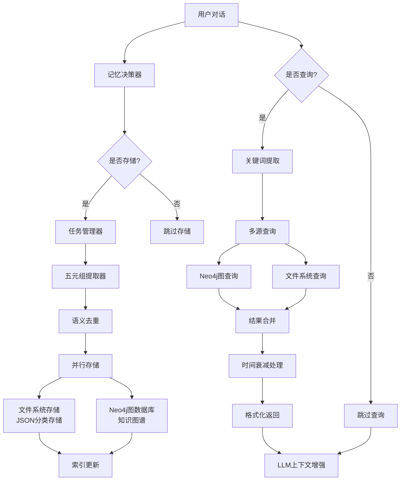
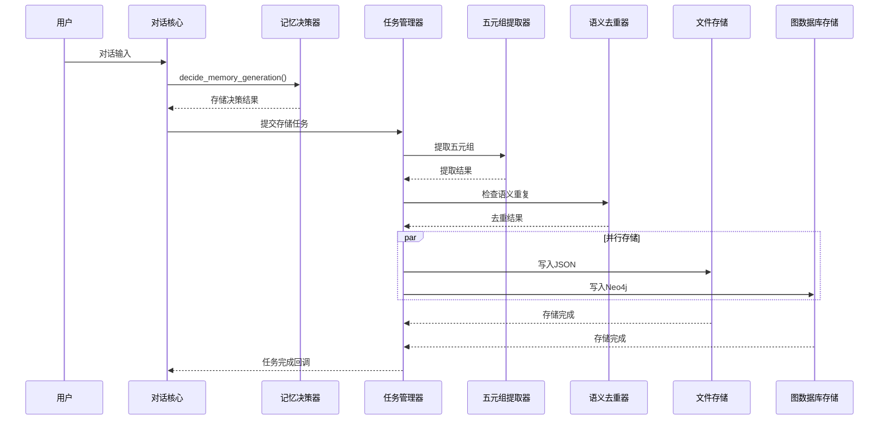
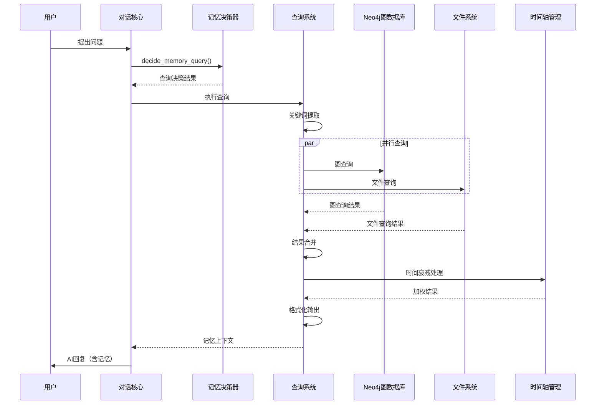

# NagaAgent GRAG 记忆系统技术文档

## 📋 文档目录

1. [GRAG记忆系统架构](#grag记忆系统架构)
2. [存储架构详解](#存储架构)
3. [五元组数据结构](#五元组数据结构)
4. [智能决策机制](#智能决策机制)
5. [工作流程详述](#工作流程详述)
6. [性能优化策略](#性能优化策略)
7. [技术实现细节](#技术实现细节)
8. [常见问题排查](#常见问题排查)

---

## 🧠 GRAG记忆系统架构

### 系统概述

NagaAgent采用革命性的**GRAG (Graph-based Retrieval-Augmented Generation)** 记忆系统，基于中文五元组知识图谱构建，实现了真正的长期记忆和智能知识管理。

### 系统流程图



---

## 💾 存储架构

### 三层存储策略

#### 1️⃣ 文件系统存储（快速访问）
- **路径**: `logs/knowledge_graph/`
- **分类存储**:
  - `fact_memories.json` - 事实记忆（客观知识、定义、数据）
  - `process_memories.json` - 过程记忆（操作步骤、工作流程）
  - `emotion_memories.json` - 情感记忆（态度偏好、情感表达）
  - `meta_memories.json` - 元记忆（反思总结、关于记忆的记忆）

**存储格式**: JSON文件，每条记录包含完整的五元组数据

#### 2️⃣ Neo4j图数据库（关系查询）
- **连接**: `neo4j://127.0.0.1:7687`
- **数据结构**: 五元组知识图谱
- **核心优势**: 支持复杂关系查询、实体关联分析

图数据库中的节点和关系：
```cypher
// 主体节点和客体节点
(n:Node {name: "用户", type: "人物"})

// 关系（谓词）
(n1)-[r:Relation {type: "询问关于", timestamp: 1732781445}]->(n2)
```

#### 3️⃣ 缓存层（高性能访问）
- **近期上下文缓存**: 最近对话的内存缓存（LRU算法）
- **任务队列缓存**: 异步任务结果缓存
- **提取结果缓存**: 五元组提取结果缓存

---

## 📊 五元组数据结构

### 核心数据模型

每条记忆都被结构化为标准化的五元组格式：

```python
from pydantic import BaseModel
from typing import Optional, List

class Quintuple(BaseModel):
    subject: str              # 主体（例如：用户、Claude、系统）
    subject_type: str         # 主体类型（人物、概念、工具等）
    predicate: str           # 谓词/关系（例如：喜欢、使用、配置）
    object: str              # 客体
    object_type: str         # 客体类型
    timestamp: str           # 人类可读时间（本地时区）
    timestamp_raw: float     # 原始时间戳（用于计算）
    session_id: str          # 会话ID
    memory_type: str         # 记忆类型：fact/process/emotion/meta
    importance_score: float  # 重要性分数（0.0-1.0，AI自动评估）
    source_dialog: Optional[str] = None  # 来源对话（可选）

class MemoryType:
    FACT = "fact"           # 事实记忆：客观事实、知识
    PROCESS = "process"     # 过程记忆：行为、操作、流程
    EMOTION = "emotion"     # 情感记忆：情感、态度、偏好
    META = "meta"          # 元记忆：关于记忆的记忆、反思
```

### 示例

```json
{
    "subject": "用户",
    "subject_type": "人物",
    "predicate": "询问关于",
    "object": "记忆系统工作原理",
    "object_type": "概念",
    "timestamp": "2025年11月28日 14:30:45",
    "timestamp_raw": 1732781445.0,
    "session_id": "session_001",
    "memory_type": "fact",
    "importance_score": 0.85,
    "source_dialog": "用户: 这个分支的记忆系统怎么工作的？\nAI: ..."
}
```

---

## 🤖 智能决策机制

### 记忆生成决策

系统不会盲目存储所有对话，而是通过AI智能判断：

#### 决策流程

```python
1. AI分析对话内容 → 是否值得存储?
   └─ 考虑因素:
      ├─ 信息的新颖性（是否已知信息）
      ├─ 重要性程度（关键事实、核心观点）
      ├─ 时效性（长期有效 vs 短期话题）
      ├─ 完整性（是否有足够上下文）
      └─ 相关性（与用户/系统相关的程度）

2. 判断记忆类型 → fact/process/emotion/meta
   └─ 分析对话的情感色彩、内容性质

3. 评估重要性 → 0.0-1.0分数
   └─ AI根据信息价值自动评估

4. 检查语义重复 → 是否已存在相似记忆?
   └─ 计算与已有记忆的语义相似度
   └─ 相似度阈值: 0.8 (可配置)

5. 执行存储 → 并行写入文件和图数据库
   └─ 异步任务管理器调度
   └─ 并行存储提升性能
```

#### 决策输出格式

```python
class MemoryGenerationDecision(BaseModel):
    should_store: bool                      # 是否存储
    memory_types: List[MemoryType]         # 记忆类型列表
    importance_score: float                # 重要性分数
    reason: str                            # 决策理由
    extract_keywords: List[str]            # 提取的关键词
```

### 记忆查询决策

同样，系统会智能判断何时需要查询记忆：

#### 决策流程

```python
1. AI分析用户问题 → 是否需要回忆过去信息?
   └─ 考虑因素:
      ├─ 问题的性质（事实查询 vs 创意生成）
      ├─ 时间相关性（是否需要历史信息）
      ├─ 上下文依赖性（是否需要背景知识）
      └─ 个性化需求（是否需要用户偏好）

2. 提取关键词 → 核心概念提取
   └─ 从问题中提取关键实体和概念

3. 构建查询 → 多维度查询条件
   └─ 关键词匹配
   └─ 时间范围过滤
   └─ 记忆类型筛选
   └─ 重要性排序

4. 时间衰减 → 旧记忆权重降低
   └─ 指数衰减公式: decay_factor = exp(-age / half_life)
   └─ 半衰期: 30天 (可配置)

5. 结果排序 → 按相关性和重要性排序
   └─ 返回最相关的N条记忆
```

#### 决策输出格式

```python
class MemoryQueryDecision(BaseModel):
    should_query: bool                     # 是否查询
    keywords: List[str]                    # 提取的关键词
    memory_types: List[MemoryType]        # 查询的记忆类型
    time_range: Optional[Tuple[int, int]]  # 时间范围（时间戳）
    top_k: int = 5                         # 返回记忆数量
```

---

## 🔄 工作流程详述

### 存储流程（异步并发）



**详细步骤说明**:

1. **对话输入**: 用户提供对话内容（问题和回答）

2. **记忆决策**: 记忆决策器AI分析对话内容，决定是否存储
   - 调用LLM进行智能判断
   - 输出决策结果（是否存储、记忆类型、重要性）

3. **任务提交**: 如果决定存储，提交到任务管理器
   - 创建异步任务
   - 加入任务队列

4. **五元组提取**: 提取器从对话中提取结构化知识
   - 识别主语、谓语、宾语
   - 确定实体类型
   - 评估重要性分数

5. **语义去重**: 检查是否已存在相似记忆
   - 计算与现有记忆的语义相似度
   - 使用Jaccard相似度和余弦相似度
   - 如果相似度>阈值(0.8)，跳过存储

6. **并行存储**:
   - **文件存储**: 写入JSON文件，按类型分类
   - **图数据库存储**: 写入Neo4j，构建知识图谱

7. **索引更新**: 更新内存索引和缓存

8. **回调通知**: 任务完成，通知对话核心

### 查询流程（智能检索）



**详细步骤说明**:

1. **问题输入**: 用户提出问题

2. **查询决策**: 记忆决策器AI分析问题，决定是否查询记忆
   - 判断问题性质（是否需要历史信息）
   - 提取关键词
   - 确定查询参数

3. **执行查询**: 查询系统并行查询多个数据源

4. **关键词提取**: 从问题中提取关键实体和概念
   - 名词提取
   - 动词提取
   - 专有名词识别

5. **并行查询**:
   - **图数据库查询**: Neo4j Cypher查询
     ```cypher
     MATCH (s)-[r]->(o)
     WHERE s.name CONTAINS $keyword OR o.name CONTAINS $keyword
     RETURN s, r, o
     ORDER BY r.timestamp_raw DESC
     ```
   - **文件查询**: JSON文件全文搜索
     - 加载分类记忆文件
     - 关键词匹配
     - 重要性过滤

6. **结果合并**: 合并来自不同数据源的结果
   - 去重处理
   - 相关性评分
   - 时间排序

7. **时间衰减**: 根据记忆的年龄调整权重
   - 计算公式: `score = importance_score * exp(-age / half_life)`
   - 年龄: 当前时间 - 记忆时间
   - 半衰期: 30天

8. **格式化输出**: 将记忆格式化为LLM可理解的文本
   ```
   [记忆上下文]
   - 2025年1月15日: 用户询问了关于...（重要性: 0.85）
   - 2025年1月10日: 系统回答了关于...（重要性: 0.72）
   ```

---

## ⚡ 性能优化策略

### 1. 并发处理优化

```python
# 使用ThreadPoolExecutor管理异步任务
from concurrent.futures import ThreadPoolExecutor

class TaskManager:
    def __init__(self, max_workers: int = 3):
        self.executor = ThreadPoolExecutor(max_workers=max_workers)
        self.task_queue = asyncio.Queue()

    async def submit_task(self, task_fn, *args, **kwargs):
        # 提交任务到队列
        await self.task_queue.put((task_fn, args, kwargs))
        # 在线程池中执行
        loop = asyncio.get_event_loop()
        return await loop.run_in_executor(
            self.executor,
            self._run_task,
            task_fn, args, kwargs
        )
```

### 2. 缓存机制

```python
# 最近查询结果缓存
from functools import lru_cache

class MemoryQueryCache:
    @lru_cache(maxsize=1000)
    def get_cached_query(self, query_key: str) -> List[Quintuple]:
        # 从缓存获取查询结果
        pass

# 高频访问记忆缓存
class MemoryLRUCache:
    def __init__(self, max_size: int = 1000):
        self.cache = OrderedDict()
        self.max_size = max_size

    def get(self, key: str) -> Optional[Quintuple]:
        if key in self.cache:
            # 移动到末尾（最近使用）
            self.cache.move_to_end(key)
            return self.cache[key]
        return None
```

### 3. 批量操作

```python
# Neo4j批量写入
from py2neo import Graph, Node, Relationship

def batch_store_memories(self, memories: List[Quintuple]):
    # 批量创建节点和关系
    nodes = []
    relationships = []

    for memory in memories:
        # 创建主体节点
        subject_node = Node("Memory", **{
            "subject": memory.subject,
            "subject_type": memory.subject_type,
            # ...
        })
        nodes.append(subject_node)

    # 批量提交
    self.graph.create(*nodes)
```

### 4. 索引优化

为高频查询字段创建Neo4j索引：

```cypher
# 在Neo4j浏览器中执行
CREATE INDEX ON :Memory(subject)
CREATE INDEX ON :Memory(timestamp_raw)
CREATE INDEX ON :Memory(memory_type)
CREATE INDEX ON :Memory(importance_score)
```

### 5. 智能预加载

```python
# 预加载高频访问的记忆
async def preload_hot_memories(self):
    # 查询重要性分数>0.8的记忆
    hot_memories = await self.query(
        importance_threshold=0.8,
        limit=100
    )
    # 加载到缓存
    for memory in hot_memories:
        self.cache.set(memory.id, memory)
```

---

## 🔧 技术实现细节

### 核心模块

#### 记忆管理器（memory_manager.py）

**主要功能**:
- 协调存储和查询流程
- 调用决策器进行智能判断
- 管理任务队列和异步执行

**关键方法**:
```python
class MemoryManager:
    async def store_memory_intelligent(
        self,
        user_question: str,
        ai_response: str
    ) -> bool:
        """智能存储记忆"""
        pass

    async def query_memory_intelligent(
        self,
        user_question: str
    ) -> Optional[str]:
        """智能查询记忆"""
        pass
```

#### 记忆决策器（memory_decision.py）

**主要功能**:
- 使用AI判断是否需要存储/查询记忆
- 提取关键词和关键信息
- 评估重要性分数

**关键方法**:
```python
class MemoryDecisionMaker:
    async def decide_memory_generation(
        self,
        question: str,
        response: str
    ) -> MemoryGenerationDecision:
        """决定是否需要生成记忆"""
        pass

    async def decide_memory_query(
        self,
        question: str
    ) -> MemoryQueryDecision:
        """决定是否需要查询记忆"""
        pass
```

#### 五元组提取器（quintuple_extractor.py）

**主要功能**:
- 从对话中提取结构化知识
- 识别实体和关系
- 评估重要性分数

**关键方法**:
```python
class QuintupleExtractor:
    async def extract_quintuples(
        self,
        question: str,
        response: str,
        memory_types: List[MemoryType]
    ) -> List[Quintuple]:
        """提取五元组"""
        pass
```

#### 语义去重器（semantic_deduplicator.py）

**主要功能**:
- 计算记忆之间的语义相似度
- 检测重复或高度相似的记忆
- 合并相似记忆

**去重算法**:
```python
def calculate_similarity(q1: Quintuple, q2: Quintuple) -> float:
    """计算两个五元组的相似度"""
    # 1. Jaccard相似度（关键词）
    words1 = set(tokenize(q1.subject + q1.predicate + q1.object))
    words2 = set(tokenize(q2.subject + q2.predicate + q2.object))
    jaccard = len(words1 & words2) / len(words1 | words2)

    # 2. 语义相似度（使用embedding）
    emb1 = get_embedding(str(q1))
    emb2 = get_embedding(str(q2))
    cosine = cosine_similarity(emb1, emb2)

    # 加权平均
    return 0.5 * jaccard + 0.5 * cosine
```

#### 时间轴管理器（time_axis_manager.py）

**主要功能**:
- 管理记忆的时间属性
- 计算时间衰减因子
- 处理时效性查询

**时间衰减算法**:
```python
def calculate_decay_factor(
    timestamp: float,
    half_life: float = 30 * 24 * 3600  # 30天
) -> float:
    """计算时间衰减因子"""
    age = time.time() - timestamp
    decay_factor = math.exp(-age / half_life)
    return max(decay_factor, 0.1)  # 最小衰减因子0.1
```

---

## 🗄️ 数据库设计

### Neo4j图数据库结构

#### 节点类型

**Memory节点**:
```cypher
CREATE (m:Memory {
    subject: "用户",
    subject_type: "人物",
    object: "Python",
    object_type: "编程语言",
    memory_type: "emotion",
    importance_score: 0.9,
    timestamp_raw: 1732781445.0,
    session_id: "session_001"
})
```

**Entity节点**（可选，用于实体消歧）:
```cypher
CREATE (e:Entity {
    name: "Python",
    type: "编程语言",
    disambiguation: "指Python编程语言，不是蟒蛇"
})
```

#### 关系类型

**Relation关系**:
```cypher
CREATE (s)-[r:RELATION {
    predicate: "喜欢",
    timestamp_raw: 1732781445.0,
    importance_score: 0.9
}]->(o)
```

### 文件存储结构

#### fact_memories.json
```json
{
  "memories": [
    {
      "id": "uuid_001",
      "subject": "Python",
      "subject_type": "编程语言",
      "predicate": "是一种",
      "object": "解释型语言",
      "object_type": "语言类型",
      "timestamp": "2025年1月15日 10:30:00",
      "timestamp_raw": 1732781400.0,
      "memory_type": "fact",
      "importance_score": 0.85,
      "keywords": ["Python", "解释型语言"]
    }
  ],
  "metadata": {
    "total_count": 1500,
    "last_updated": 1732781400.0
  }
}
```

---

## ❓ 常见问题排查

### Neo4j连接问题

**症状**: 连接超时或认证失败

**排查步骤**:
```bash
# 1. 检查Neo4j容器状态
docker ps | grep neo4j

# 2. 检查端口监听
netstat -tlnp | grep 7687

# 3. 测试连接
python -c "
from py2neo import Graph
try:
    g = Graph('neo4j://127.0.0.1:7687', auth=('neo4j', 'your_password'))
    result = g.run('RETURN 1').data()
    print('连接成功:', result)
except Exception as e:
    print('连接失败:', e)
"
```

**解决方案**:
1. 确认Neo4j服务已启动
2. 检查连接参数（URI、用户名、密码）
3. 检查防火墙设置
4. 查看Neo4j日志: `docker logs <container_id>`

### 记忆不存储问题

**症状**: 对话后没有生成记忆文件

**排查步骤**:
```python
# 1. 检查配置
from config import config
print("GRAG enabled:", config.grag.enabled)
print("Auto extract:", config.grag.auto_extract)
print("Decision enabled:", config.grag.memory_decision_enabled)

# 2. 手动测试存储
from summer_memory.memory_manager import MemoryManager
manager = MemoryManager()
result = await manager.store_memory_intelligent("测试问题", "测试回答")
print("存储结果:", result)
```

**常见原因**:
1. 记忆决策器判断不需要存储
2. 语义去重过滤了相似记忆
3. 任务管理器未正确初始化
4. 存储路径权限不足

### 记忆查询无结果

**症状**: 查询记忆返回空结果

**排查步骤**:
```python
# 1. 检查是否有记忆数据
import os
print("记忆文件存在:", os.path.exists("logs/knowledge_graph/fact_memories.json"))

# 2. 手动查询测试
from summer_memory.quintuple_rag_query import RAGQuintupleQuery
query = RAGQuintupleQuery()
results = await query.query_by_keywords(["测试"])
print("查询结果数:", len(results))

# 3. 检查决策器输出
from summer_memory.memory_decision import MemoryDecisionMaker
decision = await MemoryDecisionMaker().decide_memory_query("测试问题")
print("查询决策:", decision.should_query)
```

**常见原因**:
1. 查询决策器判断不需要查询
2. 关键词不匹配
3. 时间范围过滤太严格
4. 相似度阈值设置过高

### 查询性能慢

**症状**: 查询记忆耗时过长（>2秒）

**优化措施**:

1. **创建Neo4j索引**:
```cypher
CREATE INDEX ON :Memory(subject)
CREATE INDEX ON :Memory(timestamp_raw)
CREATE INDEX ON :Memory(memory_type)
```

2. **启用缓存**:
```python
# 在config.json中配置
"grag": {
    "cache_enabled": true,
    "cache_size": 1000,
    "cache_ttl": 3600
}
```

3. **减少查询范围**:
```python
# 调整上下文长度
"context_length": 3  # 从5减少到3
```

4. **批量预加载**:
```python
# 启动时预加载高频记忆
async def preload_memories():
    hot_memories = await query_by_importance(0.8)
    cache.load(hot_memories)
```

### 存储性能慢

**症状**: 存储记忆耗时过长

**优化措施**:

1. **增加工作线程**:
```python
# 调整max_workers
"max_workers": 5  # 从3增加到5
```

2. **启用批量存储**:
```python
# 修改task_manager.py
BATCH_SIZE = 100  # 每100条批量提交
```

3. **优化Neo4j配置**:
```bash
# 在docker run时增加内存限制
docker run -d \
  -e NEO4J_dbms_memory_heap_max__size=2G \
  -e NEO4J_dbms_memory_pagecache_size=1G \
  ...
```

---

## 📊 监控和调试

### 日志输出配置

```json
{
  "system": {
    "debug": true,
    "log_level": "DEBUG"
  }
}
```

### 关键日志信息

**存储日志**:
```
[Memory] 决策: 需要存储 (重要性: 0.85)
[Memory] 提取: 3个五元组
[Memory] 去重: 0个重复
[Memory] 存储: 文件+图数据库 (耗时: 0.23s)
```

**查询日志**:
```
[Memory] 查询决策: 需要查询
[Memory] 关键词: ["Python", "学习"]
[Memory] 查询结果: 5条记忆
[Memory] 查询耗时: 0.15s
```

### 性能监控指标

```python
# 在代码中添加性能监控
import time

start = time.time()
result = await store_memory_intelligent(q, a)
duration = time.time() - start

print(f"存储耗时: {duration:.3f}s")
print(f"存储结果: {result}")
```

---

## 🔧 高级配置

### 配置参数详解

```json
{
  "grag": {
    "enabled": true,
    "auto_extract": true,
    "intelligent_memory_enabled": true,
    "memory_decision_enabled": true,
    "context_length": 5,
    "similarity_threshold": 0.8,
    "max_workers": 3,
    "task_timeout": 600,
    "decision_model": "deepseek-chat",
    "extraction_model": "deepseek-chat",
    "time_decay_half_life": 2592000,
    "min_decay_factor": 0.1
  }
}
```

**参数说明**:
- `similarity_threshold`: 语义去重相似度阈值（0.0-1.0），值越高去重越严格
- `max_workers`: 任务管理器的最大工作线程数
- `task_timeout`: 任务超时时间（秒）
- `time_decay_half_life`: 时间衰减半衰期（秒，默认30天）
- `min_decay_factor`: 最小衰减因子，防止记忆权重过低

### 调优建议

**对于个人用户**:
```json
{
  "context_length": 3,
  "similarity_threshold": 0.85,
  "max_workers": 2
}
```

**对于高频对话**:
```json
{
  "context_length": 10,
  "similarity_threshold": 0.75,
  "max_workers": 5
}
```

**对于开发调试**:
```json
{
  "intelligent_memory_enabled": false,
  "memory_decision_enabled": false,
  "auto_extract": true
}
```

---

## 📚 相关文档

- [README.md](../README.md) - 项目主文档
- [配置说明](#配置说明) - 配置文件详解
- [API文档](../apiserver/README.md) - RESTful API接口
- [配置热更新](../CONFIG_HOT_RELOAD_GUIDE.md) - 配置热更新系统

---

**注意**: 本文档详细描述了GRAG记忆系统的技术实现细节，适合开发者和高级用户阅读。如需基础使用说明，请参考[README.md](../README.md)。
