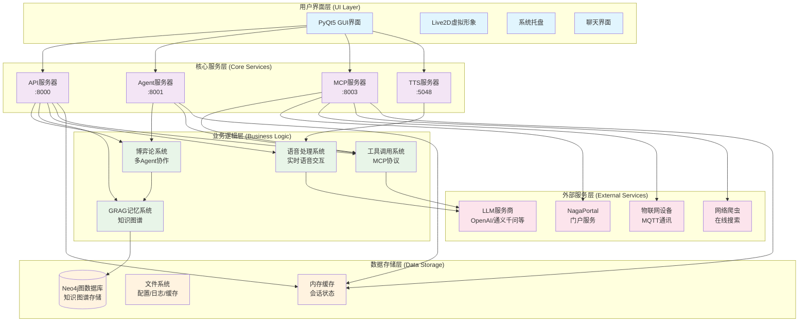
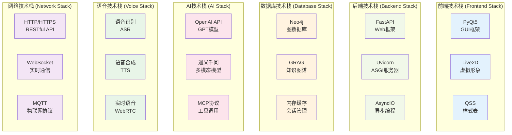

# NagaAgent

[简体中文](README.md)|[繁體中文](README_tw.md)|[English](README_en.md)


---

## [此处获取教程视频与一键运行整合包](https://www.pylindex.top/naga)


## 介绍

NagaAgent 是一个功能丰富的智能对话助手系统，具有以下特色功能：

### 🎯 核心功能
- **智能对话系统**：支持流式对话和工具调用循环
- **多Agent协作**：基于博弈论的智能任务调度
- **知识图谱记忆**：GRAG系统支持长期记忆和智能检索
- **完整语音交互**：实时语音输入输出处理
- **现代化界面**：PyQt5 GUI + Live2D虚拟形象
- **系统托盘集成**：后台运行和快捷操作

### 🛠️ 技术架构

#### 系统整体架构


#### 核心特性
- **多服务并行**：API服务器(8000)、Agent服务器(8001)、MCP服务器(8003)、TTS服务器(5048)
- **模块化设计**：各服务独立运行，支持热插拔
- **配置驱动**：实时配置热更新，无需重启
- **跨平台支持**：Windows、macOS、Linux

### 🔧 技术栈

#### 技术栈架构


#### 核心技术
- **Python 3.11** + PyQt5 + FastAPI
- **Neo4j图数据库** + GRAG知识图谱
- **MCP (Model Context Protocol)** 工具调用
- **OpenAI兼容API** + 多种LLM服务商支持


---

## 部署运行教程

### 环境要求
- Python 3.11
- 可选：uv工具（加速依赖安装，且无需特定python版本）

### 快速开始

>  如果您的部署有困难，可以参考视频教程或下载一键运行整合包。

#### 1. 安装依赖
##### 使用setup脚本

```bash
# 可选：先安装uv
pip install uv

# 使用 setup.py 自动初始化
python setup.py

# 或使用 setup.sh (Linux/macOS)
./setup.sh

# 或使用 setup.bat (Windows)
setup.bat
```

初始化脚本会自动：
- 检测Python版本
- 创建虚拟环境
- 安装依赖包
- 复制配置文件模板
- 打开配置文件供编辑
</details>

<details><summary>手动部署</summary>

```bash
# 无uv
python -m venv .venv

# linux/Mac OS
source .venv/bin/activate
# Windows
.\.venv\Scripts\activate

pip install -r requirements.txt

# 使用uv
uv sync
```
</details>

#### 2. 配置LLM API
编辑 `config.json` 文件，配置您的LLM API信息：
```json
{
  "api": {
    "api_key": "你的api_key",
    "base_url": "模型服务商OPENAI API端点",
    "model": "模型名称"
  }
}
```

<details><summary>可选配置</summary>

#### 启用知识图谱记忆

使用 `docker` 安装 `neo4j` 或安装 `neo4j desktop` 并在 `config.json` 中配置 Neo4j 连接参数：
```json
{
  "grag": {
    "enabled": true,
    "neo4j_uri": "neo4j://127.0.0.1:7687",
    "neo4j_user": "neo4j",
    "neo4j_password": "你安装neo4j时设置的密码"
  }
}
```

#### 启用语音输出功能
```json
{
  "system": {
    "voice_enabled": true
  },
  "tts": {
    "port": 5048
  }
}
```

#### Live2D 相关配置

```json5
  "live2d": {
    "enabled": false, # 是否启用Live2D
    "model_path": "ui/live2d_local/live2d_models/重音テト/重音テト.model3.json", # Live2D模型路径
    "fallback_image": "ui/img/standby.png", # 备用图片
    "auto_switch": true, # 是否自动切换
    "animation_enabled": true, # 是否启用动画
    "touch_interaction": true # 是否启用触摸交互
  },
  ```

#### 启用 GPT-SoVITS 语音合成

GPT-SoVITS 是一个高性能的 TTS 系统，支持声音克隆功能。当启用后，将使用外部部署的 GPT-SoVITS 服务替代默认的 edge-tts。

**配置方法：**

1. **部署 GPT-SoVITS 服务**（如果尚未部署）
   ```bash
   # 参考 GPT-SoVITS 官方仓库部署
   # 默认运行在 http://127.0.0.1:9880
   ```

2. **准备参考音频**
   - 选择一段清晰的语音文件（推荐 10-30 秒）
   - 准确记录该音频对应的文本内容
   - 确保 GPT-SoVITS 服务可以访问参考音频路径

3. **配置 config.json**
   ```json
   {
     "tts": {
       "sovits": {
         "enabled": true,      // 启用 GPT-SoVITS（优先级最高）
         "api_url": "http://127.0.0.1:9880",  // SoVITS API 地址
         "reference_audio": "/path/to/reference.wav",  // 参考音频路径
         "reference_text": "参考音频的文本内容",  // 必须与音频匹配
         "language": "zh",       // 语言代码：zh/ja/en
         "timeout": 120         // 请求超时时间（秒）
       }
     }
   }
   ```

**功能特性：**

- **声音克隆**：使用参考音频克隆特定音色
- **流式支持**：流式模式下遇到标点（。；！？）立即合成
- **顺序播放**：确保多个音频按句子顺序播放，不乱序
- **自动清理**：播放完成后自动删除临时音频文件
- **优先级高**：`sovits.enabled = true` 时将无视其他 TTS 配置

**注意事项：**

- 确保参考音频路径是 GPT-SoVITS 服务可以访问的绝对路径
- `reference_text` 必须准确匹配参考音频的内容
- 如果 SoVITS 推理较慢，可适当增加 `timeout` 值
- 流式模式标点：。；！？.\\?\\!\\;（不包含逗号）
- 非流式模式：按句号切割后异步生成

> 其他配置项可参考注释

</details>

#### 3. 启动应用
```bash
# 使用启动脚本
./start.sh          # Linux/macOS
start.bat           # Windows


# 或直接运行py文件
# linux/Mac OS
source .venv/bin/activate
# Windows
.\.venv\Scripts\activate
python main.py

# uv
uv run main.py
```

> 程序会自动检测上次系统检测时间，如果检测通过且超过7天，会自动执行更新并重启。

#### 手动更新
```bash
# 使用更新脚本
./update.sh         # Linux/macOS
update.bat          # Windows

# 或直接运行py文件
python update.py
```

更新脚本会自动执行 git pull（自动检测当前分支）和 uv sync 同步依赖。


<details><summary>故障排除</summary>

1. **Python 版本不兼容**：确保使用Python 3.11
2. **端口被占用**：检查8000、8001、8003、5048端口是否可用
3. **Neo4j 连接失败**：确保Neo4j服务正在运行
4. **检测 Neo4j 连接时出现 json 解析错误**：退出并重新启动程序
5. **未知错误**：请创建issue以反馈

</details>

<details><summary>环境检测</summary>

```bash
# 运行系统环境检测
python main.py --check-env --force-check

# 快速检测
python main.py --quick-check
```

</details>


## 许可证

[NagaAgent License](LICENSE)


## 贡献

欢迎创建Issue和Pull Request！

<details><summary>构建一键运行整合包</summary>

```bash
python build.py
```
构建完成的文件位于`dist/`目录下

</details>

## Star History

[](https://www.star-history.com/#Xxiii8322766509/NagaAgent&type=date&legend=top-left)

<div align="center">

**感谢所有开发者对本项目做出的贡献**

**⭐ 如果这个项目对您有帮助，请考虑给我们一个 Star**

</div>
